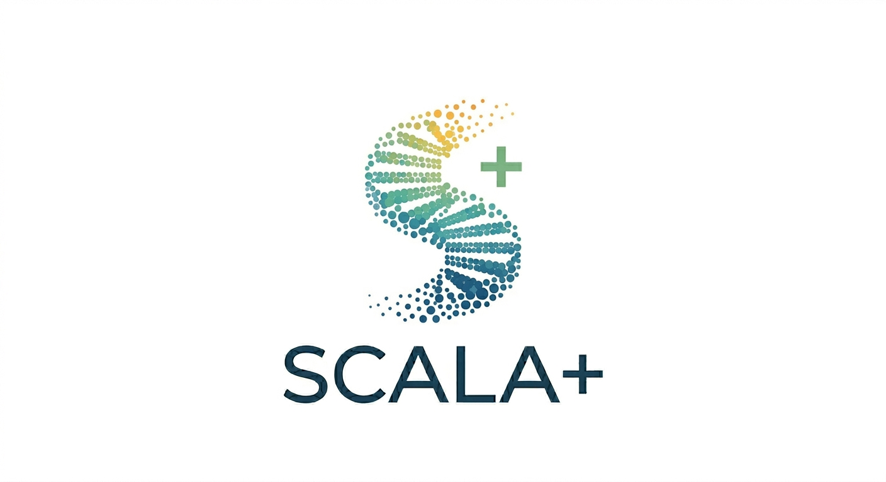

# SCALA+

A modified and extended version of [SCALA](https://github.com/PavlopoulosLab/SCALA) for multimodal analysis of single cell next generation sequencing data, with full Seurat v5 compatibility and significant additional analytical capabilities (modified since 2023).

## About

SCALA+ is based on the original SCALA developed by the teams at Biomedical Sciences Research Center "Alexander Fleming". We gratefully acknowledge the original SCALA developers for creating the foundation upon which SCALA+ is built.

For installation instructions and basic usage, please refer to the [original SCALA repository](https://github.com/PavlopoulosLab/SCALA).

### Citation

If you use SCALA+, please cite the original SCALA paper:

> Tzaferis C., Karatzas E., Baltoumas F.A., Pavlopoulos G.A., Kollias G., Konstantopoulos D. (2023) **SCALA: A web application for multimodal analysis of single cell next generation sequencing data.** *Computational and Structural Biotechnology Journal*; doi: [https://doi.org/10.1016/j.csbj.2023.10.032](https://doi.org/10.1016/j.csbj.2023.10.032)

----

## New Modules (not in original SCALA)

- **h5ad (AnnData) / CellBender h5 / qs/qs2** file import
- **Visium spatial transcriptomics** data import and analysis
- **Sample demultiplexing** (hashDemux, demuxmix, deMULTIplex2)
- **DropletQC** (emptyDrops)
- **CellBender remove-background**
- **Velocyto** RNA velocity
- **scDblFinder** doublet detection
- **DEG analysis** (separate from marker identification)
- **Gene Set Score** (UCell, GSDensity)
- **Pseudobulk analysis**
- **CellChat** cell-cell communication analysis
- **BANKSY** spatially-aware clustering
- **Harmony / Scanorama / FastMNN / SCTransform** batch correction
- Seurat v5 `IntegrateLayers` (CCA, RPCA, Joint PCA)
- Leiden clustering (replacing Louvain)

## Rewritten Modules

- **SCENIC / pySCENIC** — fully rewritten gene regulatory network analysis
- **NicheNet** — fully rewritten ligand-receptor analysis (v2 databases)
- **Slingshot** — fully rewritten trajectory analysis

## Seurat v5 Compatibility

- Full Seurat v5 (Assay5) support across all modules

----

## License

This project is licensed under the GNU General Public License v3.0 - see the [LICENSE](LICENSE) file for details.
